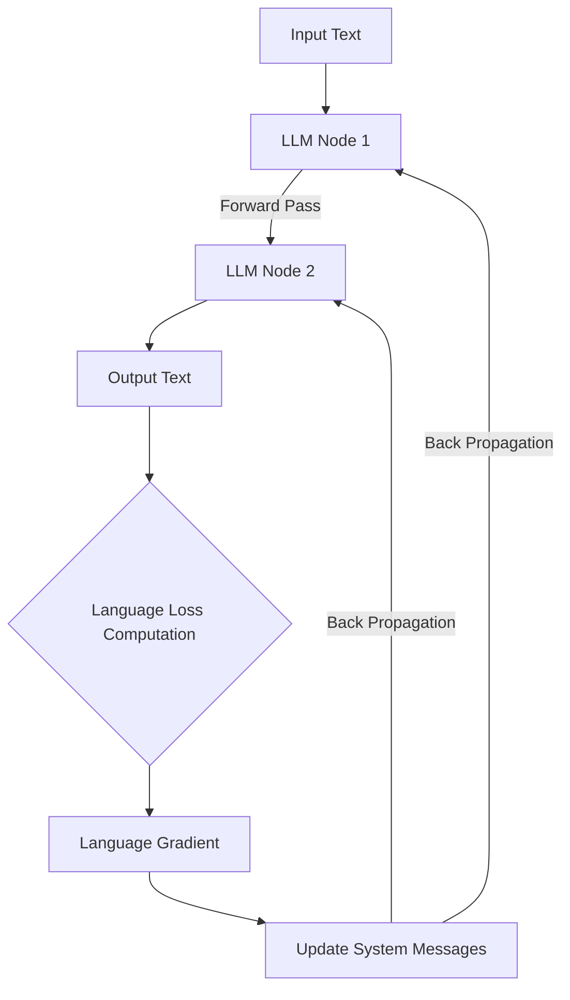

### Link : https://arxiv.org/pdf/2406.18532
---
### Notes
- Changing Agent System from model-centric, or engineering-centric to data-centric.
- Author introduces *agent symbolic learning*, a systematic framework that enables language agents to optimize themselves on their own in a data-centric way using *symbolic optimizers*.
- Symbolic network within language agents by mimicking two fundamental algorithms in connectionist learning: back-propagation and gradient descent.
- Open-source framework on *data-centric* agent learning i.e. "self-evolving agents".

### Interesting perspective
- Language agents can be viewed as AI systems that connect connectionism AI (i.e., the LLM backbone of agents) and symbolism AI (i.e., the pipeline of prompts and tools).
- Most current optimization methods, are prone to local optimum of isolated prompts, tools, and nodes that leads to compromised performance for the entire agent system. This resembles the early practice in training neural nets where layers are separately optimized and it now seems trivial that optimizing neural nets as a whole leads to better performance. 
- Author believe that this is also the case in agent optimization and jointly optimization of all symbolic components within an agent is the key for optimizing agents. 

### Problem Formulation
Key Components of the framework.
##### Agent Pipeline : 
- *agent pipeline* is sequence of nodes though which the agent process input data
##### Node :
- individual step with the agent pipeline
- node -- input (either from human, or from previous node)
- node -- output is passed to the next node
- node has prompt and tools
##### Trajectory :
- similar to neural nets, the trajectory stores all information during forward pass
	- inputs
	- outputs
	- prompts
	- tools
- and is responsible for gradient back-propagation
##### Language Loss :
- measure discrepancy between the expected and actual outcomes
- produced by natural language loss function implemented by carefully designed prompt
##### Language Gradient : 
*language gradients* are textual analyses and reflections used for updating each component in the agent with respect to the language loss

### Agent Symbolic Learning Procedure

##### Forward Pass : 
- forward pass is almost identical to standard agent execution
- store the input, prompts, tool usage, and output to *trajectory*
##### Language Loss Computation :
- after forward pass, language loss is calculated by feed *trajectory* into an LLM using a designed prompt template
	- $\mathcal{L}_{\text{lang}}$ = language loss 
	- $\mathcal{P}_{\text{loss}}$ = prompt loss template
	- $(\tau)$ = trajectory

$$
\mathcal{L}_{\text{lang}} = \text{LLM}(\mathcal{P}_{\text{loss}}(\tau))
$$

##### Back-propagation of Language Gradients : 
- iterate from last node to the first node and compute the gradient for each node with LLMs using a designed prompt
	- $\mathbf{\nabla}_{\text{lang}}^n$ = language gradient of node $n$ 
	- $\mathcal{P}_{\text{gradient}}$ = prompt gradient template
	- ${\nabla}_{\text{lang}}^{n+1}$ = language gradient of node $n+1$ 
		- $\mathcal{I}_n$ = input of node $n$
		- $\mathcal{O}_n$ = output of node $n$
		- $\mathcal{P}_n$ = prompt of node $n$
		- $\mathcal{L}_{\text{lang}}$ = language loss

 $$
  \mathbf{\nabla}_{\text{lang}}^n = \text{LLM}(\mathcal{P}_{\text{gradient}}(\mathbf{\nabla}_{\text{lang}}^{n+1}, \mathcal{I}_n, \mathcal{O}_n, \mathcal{P}_n, \mathcal{T}_n, \mathcal{L}_{\text{lang}}))
$$

##### Language Gradient-based Update : 
- final step to update the prompts and tools in each node 
- and optimize the overall agent pipeline with the help of language gradients
	- **Prompt Optimizer** : Split prompts into different components, including task description, few-shot examples, principles, and output format control.
	- **Tool Optimizer** : Pipeline of prompts that that is designed for tool editing, deletion, and creation.
	- **Pipeline Optimizer** : Goal is to optimize the agent pipeline consisting of nodes and their connections.

##### Batched Training : 
- The whole optimization scheme works with one training example at a time. 
- Repeated for the complete batch to get the final system.

### Results 
- Results on standard LLM benchmarks, the proposed agent symbolic learning framework consistently improves over all compared methods.
- Unlike conventional LLM-based prompt optimization method and the search-based prompt optimization approach ([DSPy](https://github.com/stanfordnlp/dspy)), which are not stable, i.e. good performance in some cases, and degration in some other cases. ASLF is more robust and can optimize the performance of language agents more effectively. 

| Task <> Baseline     | GPTs    | Agents  | ASLF        |
| -------------------- | ------- | ------- | ----------- |
| Software development | 1.6     | 2.4     | **3.8**     |
| Creative             | 6.0     | 6.0     | **7.4**     |
| HotPotQA             | 33/44.3 | 39/49.8 | **41/54.0** |
| MATH                 | 53.1    | 56.0    | **60.7**    |
| HumanEval            | 71.7    | 85.0    | **85.8**    |

